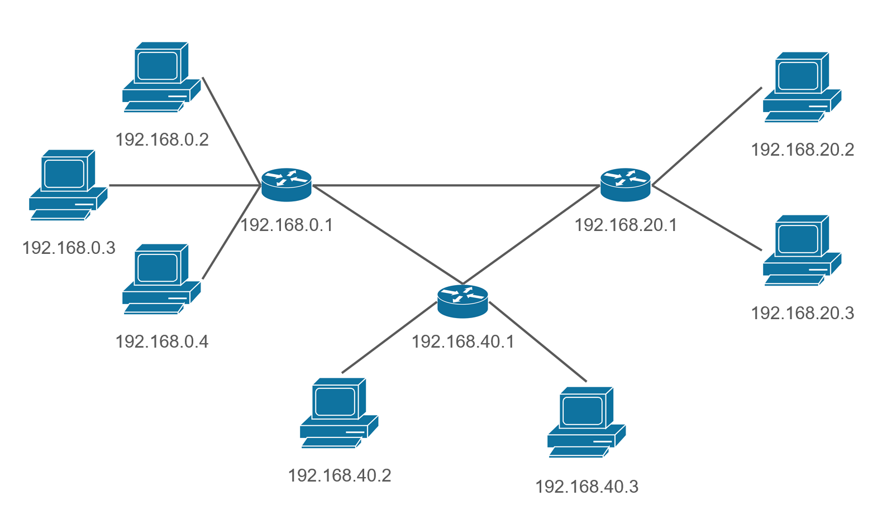
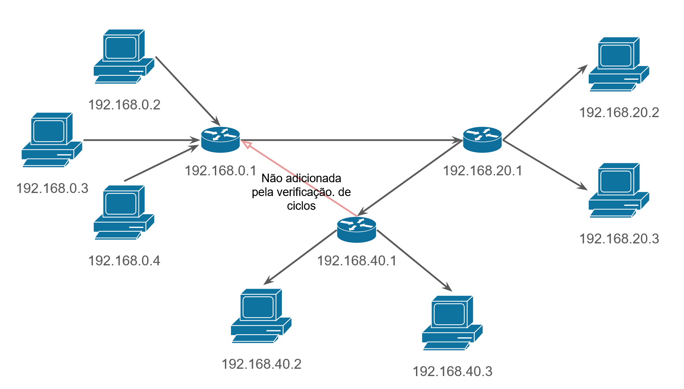

# Graphs

O aplicativo desenvolvido para a utilização da biblioteca de grafos foi uma
simulação de dispositivos de rede, com servidores, roteadores e estações de
trabalho, workstations mas nenhuma funcionalidade muito aprofundada. 

Os dispositivos são vértices e as conexões de rede, as arestas.

## Implementações

### Algoritmo de Dijkstra

Implementado na classe [Graph](src/lib/Graph.java?#L102), para obter o caminho mínimo, em questão de custo, entre dois pontos no grafo.

Pode ser selecionado a executar no menu do programa, onde devem ser passados dois parametros, origem e destino. Ambos devem ser dispositivos ja cadastrados, onde o usuário escolherá quais dispositivos digitando seu IP quando requisitado pelo programa na linha de comando.

### Verificação de ciclos

Implementado na classe [Graph](src/lib/Graph.java?#L194), verifica se é possível iniciar um caminho por um nó, passar pelo grafo e retornar a ele.

Utilizado na criação de conexões para um **Grafo Direcional**.
O processo funciona da seguinte forma:

1. É implementado na classe grafo uma função que verifica se contém ciclos no grafo atual.
2. Na execução, é criado um clone profundo, com as mesmas vértices e arestas, e temporário do grafo atual.
2. Neste grafo temporário é adicionado esta nova conexão desejada. 
3. Ainda no grafo temporário, é chamada a função que retornará **true** ou **false** para existência de ciclo no grafo.
4. Caso retorne **false**, a nova conexão será adicionada ao grafo atual, caso contrário, não.

## Como utilizar

A aplicação possui dois arquivos com métodos Main: **Main.java** e **MainTestes.java**.

### Main.java

O arquivo `Main.java`, na raiz do projeto, contém um menu interativo onde o usuário pode criar seus dispositivos pela linha de comando após executado seu método main.

No código main já contém um sistema pré-criado, que seu comportamento muda caso mude a [instanciação da classe Rede](Main.java?#L12) para um grafo direcional.

Aqui uma representação do grafo em imagem de como esse sistema é, caso criado para ser bidirecional:

Agora, se criado de forma direcional:

E há mudanças no comportamento na adição de conexões, mais sobre isso nas [informações da Classe Rede](#classe-rede) abaixo.

### MainTestes.java

O arquivo `MainTestes.java` contém instanciações estáticas das funções do programa, utilizado para testar diretamente, como implicito no seu nome.

## Classe Rede

Implementa as utilidades da biblioteca Grafo, porém, é criada apenas para [Dispositivos](src/app/Dispositivo.java), indicando que são dispositivos de Rede, todos devem conter IP.

Na sua instanciação, deve ser passado um parâmetro booleano indicando se o Grafo será bidirecional, ou não.
-   Um **Grafo Bidirecional** não terá checagem de ciclos, ao adicionar novas conexões.
-   Um **Grafo Direcional** terá checagem de ciclos, e não deixará criar essa conexão, assim configurando um grafo direcionado.

Utiliza uma ArrayList de dispositivos, para manter os dispositivos utilizáveis, selecionáveis, em memória para o usuário escolher ao longo do decorrer do programa.

